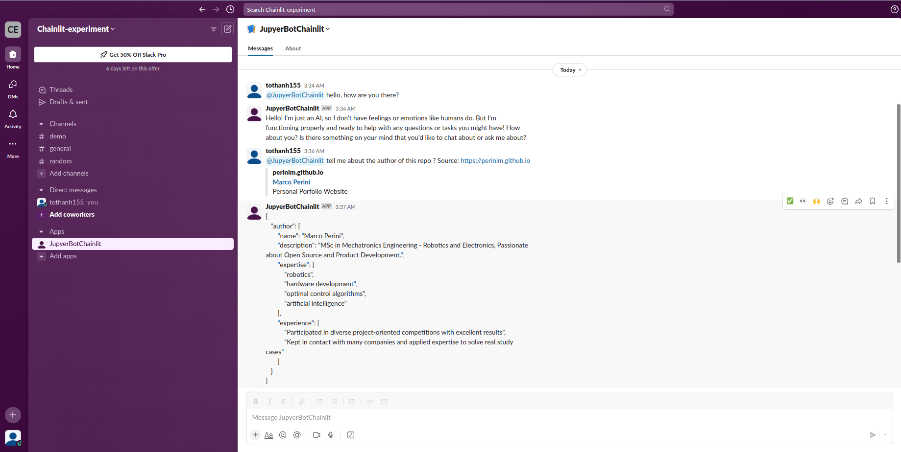
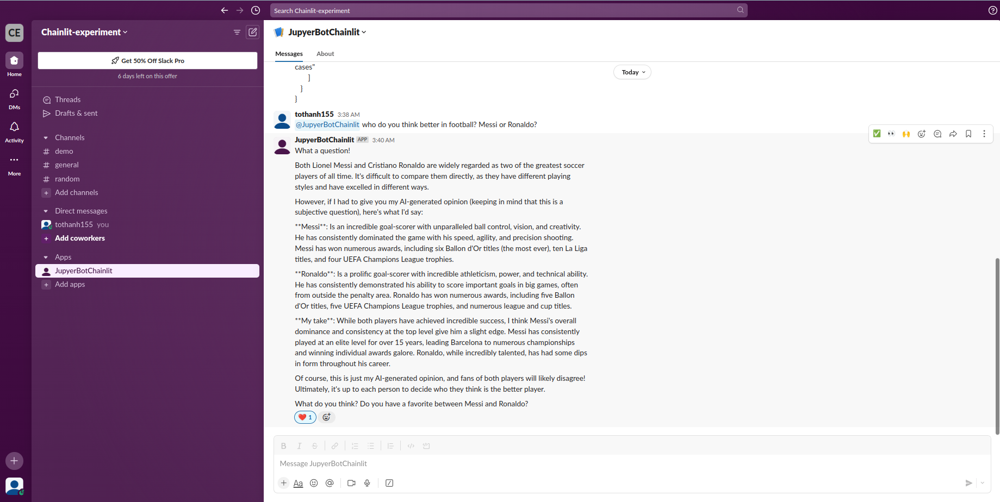

# Chainlit Integration with Slack

`chainlit + ollama + scrapegraphai`

This repository is a simple app to demonstrate the deployment of Chainlit on Slack.

## Set up

### Install the environments

```bash
conda create -n chainlit-env python=3.9
conda activate chainlit-env
pip install -r requirements.txt
```

We also need to install Playwright for javascript-based scraping. You can refer to this repo for more information: [Scrapegraph-ai](https://github.com/VinciGit00/Scrapegraph-ai)

```bash
playwright install
```

### Install ollama

```bash
docker run -d --gpus=all -v ollama:/root/.ollama -p 11434:11434 --name ollama ollama/ollama
```

I chose `llama3` as the LLM and `nomic-embed-text` as the embedding model.

```bash
docker exec -it ollama bash
docker pull llama3
docker pull nomic-embed-text
```

## Create a Slack app

You can refer to this document to create a Slack app and set up the necessary environment variables: [https://docs.chainlit.io/deploy/slack](https://docs.chainlit.io/deploy/slack)

## Run the application

```bash
chainlit run app.py -h
```

## Result




## To do

- [ ] Add chat history feature.
